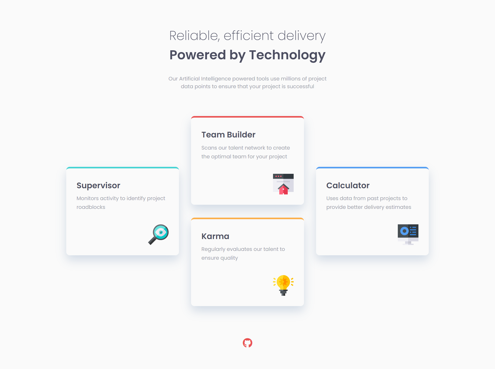

# Four Feature Card Section


## Links
- [Challenge Link](https://www.frontendmentor.io/challenges/four-card-feature-section-weK1eFYK)
- [Site Preview](https://robinjmm-feature-section.vercel.app/)

## About
This is my solution for the challenge of building a feature section with four cards from [Frontendmentor.io](https://frontendmentor.io).

The goal of the challenge is to re-create the design of a website's feature section. The section have four cards with different layouts for mobile and desktop screens. The section's design for desktop and large screens allowed me to practice my CSS positioning skills for creating non-standard layout.

## User Stories
The user should be able to:
- View the optimal layout depending on their device's screen size.

## Built With
- HTML5
- CSS3
- Flexbox
- Sass
- PostCSS

## Usage
You can download the project files by clicking on the green **Code** button, then select **Download Zip**.

Once you finish extracting, open the terminal, move into the project folder,  and type the following code:

```
npm install
```
This will install all the required dependencies.

To compile Sass into CSS and watch for any future changes, type the following code in your terminal:

```
npm run sass
```

To compile Sass into a minified version of CSS, run:

```
npm run prod
```

## Acknowledgement
I'm very grateful to the people at [Frontendmentor.io](https://frontendmentor.io) for providing designs and challenges that help me improve my skills as a web developer.